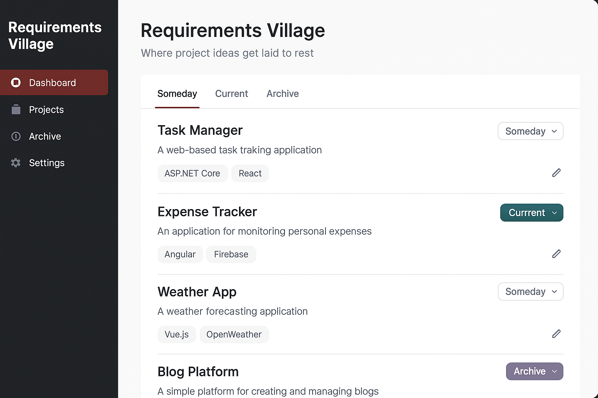
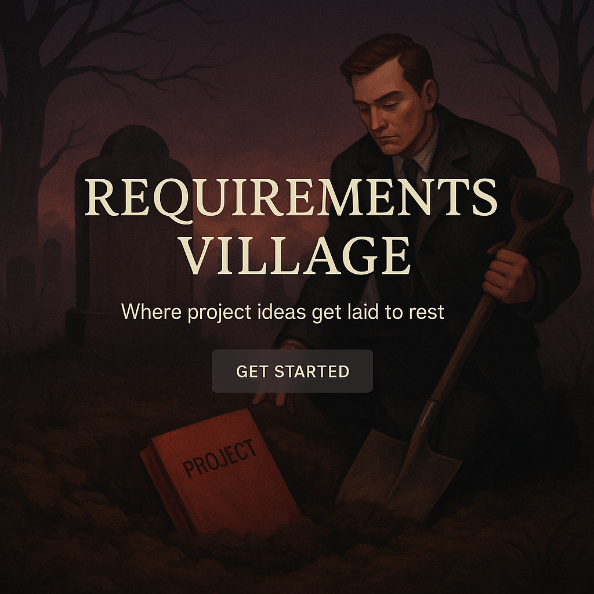
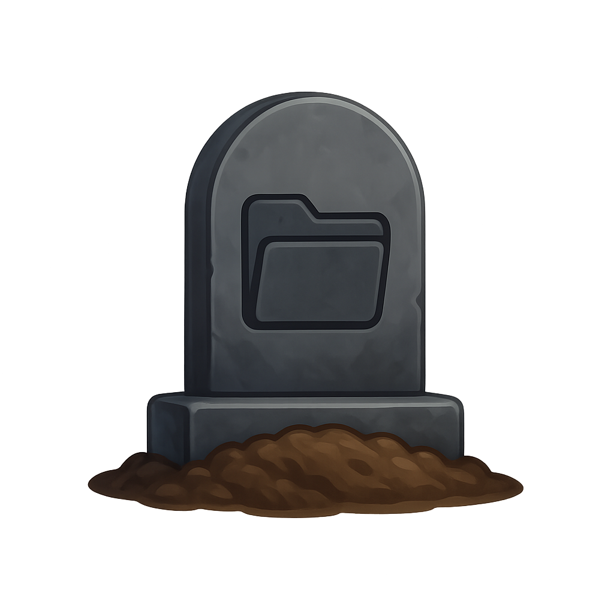

# CLAUDE.md

## 🏗️ Project Overview

**Project Name:** Requirements Village  
**Tagline:** *Where project ideas get laid to rest*  
**Purpose:** An application designed to help users catalog, organize, and reflect on their myriad project ideas—especially those that may never come to fruition. It serves as a structured repository for the indecisive, allowing for detailed specification without the commitment of execution.

---

## 🧰 Tech Stack

- **Frontend:** SvelteKit + TypeScript + Tailwind CSS + DaisyUI
- **Backend:** C# Minimal API
- **Data Access:** Entity Framework Core
- **Authentication:** ASP.NET Core Identity
- **Database:** SQLite

---

## 📂 Project Structure

```
RequirementsVillage/
├── client/          # SvelteKit frontend
└── api/             # C# Minimal API backend
```

Each project has its own `CLAUDE.md` file with specific details.

---

## 🚀 Development Status

### ✅ Client (Frontend)
- SvelteKit project with TypeScript
- Tailwind CSS + DaisyUI styling
- Unit testing with Vitest
- Integration testing with Playwright
- ESLint + Prettier configuration
- Hello World page demonstrating tech stack

### 🔲 API (Backend)
- Coming soon - C# Minimal API setup

---

## 🛠️ Development Commands

### Client
```bash
cd client
npm install
npm run dev        # Development server
npm test          # Run all tests  
npm run check     # TypeScript checking
npm run lint      # Code linting
```

---

## 🧭 Project Features

- **User Management:**
  - Account registration and login
  - Password reset functionality

- **Project Idea Management:**
  - Create, edit, and delete project ideas
  - Categorize ideas (e.g., "Someday", "In Progress", "Completed")
  - Assign tags and notes to each idea
  - Search and filter functionality

## 🎨 Visual References

These mockups demonstrate the intended tone, layout, and visual style of Requirements Village. All images are stored in `./assets/claude/`.

---

### 🧩 UI Mockup

A professional, SaaS-style interface mockup showing the project list screen layout and component arrangement:



---

### 🪦 Landing Page Mockup

Full-screen Gothic landing page concept featuring a project burial scene with overlaid branding. This sets the tone of polished irreverence and light existential despair:



---

### 🗿 Icon Mockup

A realistic app icon concept showing a gravestone with a project folder symbol — suitable for branding, headers, or favicon use:


