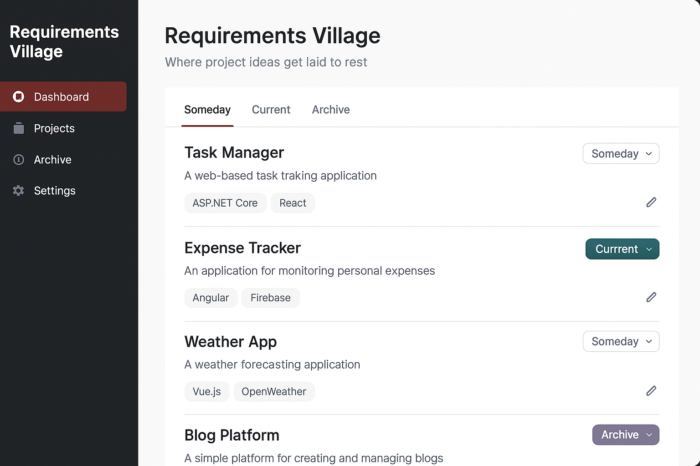
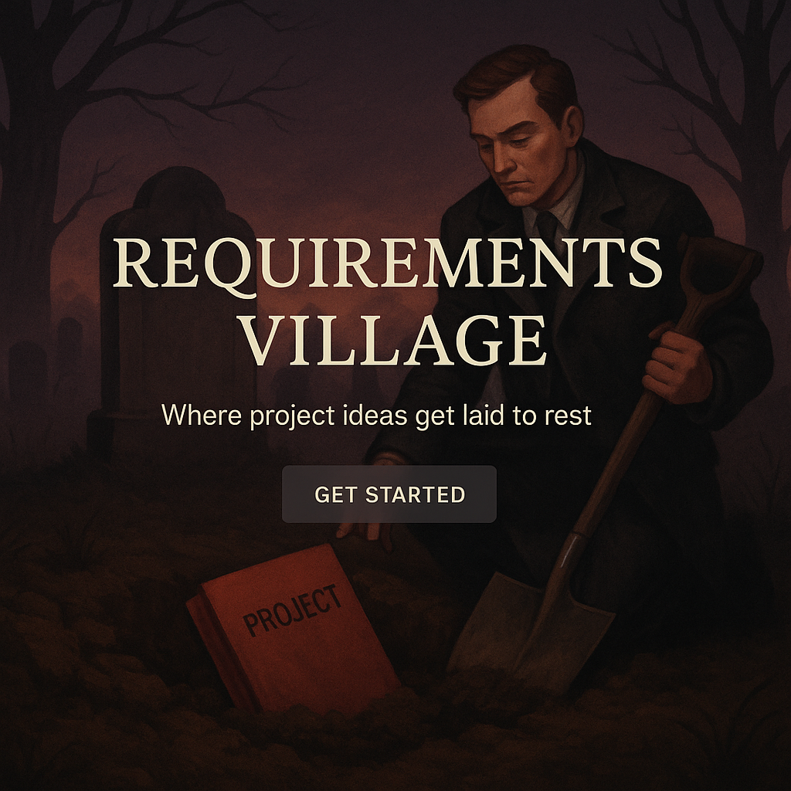
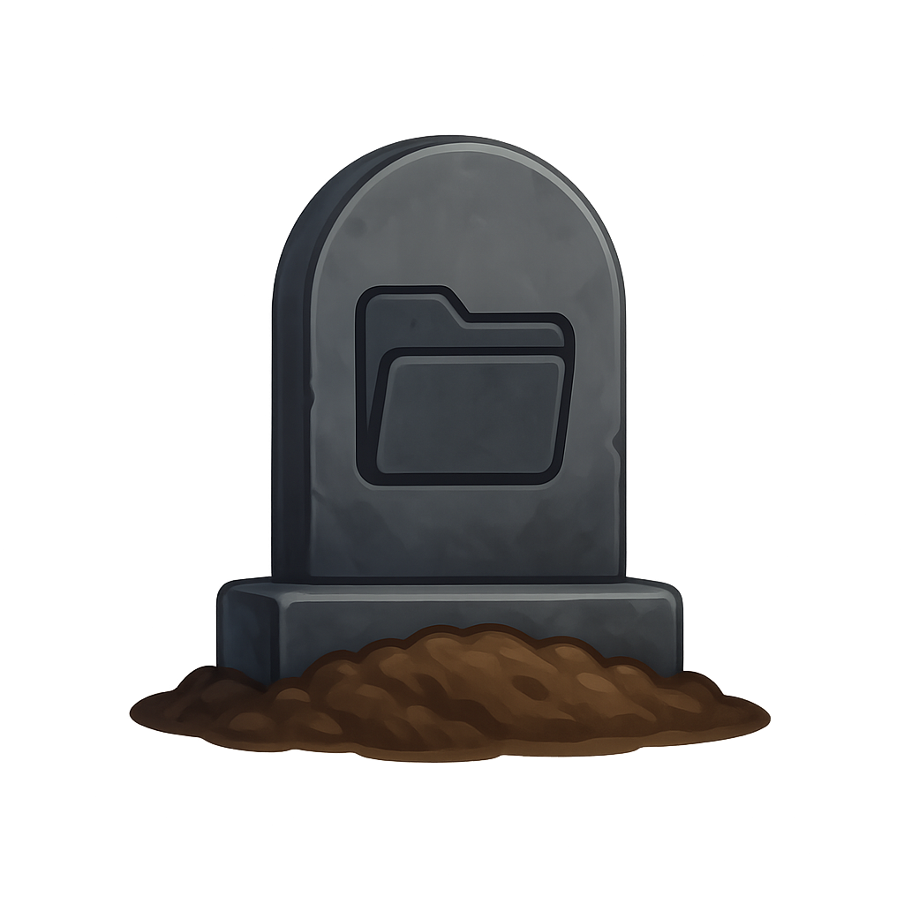

# CLAUDE.md

## 🏗️ Project Overview

**Project Name:** Requirements Village  
**Tagline:** *Where project ideas get laid to rest*  
**Purpose:** An application designed to help users catalog, organize, and reflect on their myriad project ideas—especially those that may never come to fruition. It serves as a structured repository for the indecisive, allowing for detailed specification without the commitment of execution.

---

## 🧰 Tech Stack

- **Frontend:** F# + Fable + Elmish + Feliz + Feliz.Bulma + Bulma CSS
- **Backend:** F# + Giraffe + ASP.NET Core
- **Data Access:** Dapper with SQLite (implemented but using in-memory storage)
- **Authentication:** ASP.NET Core Identity (not yet implemented)
- **Database:** SQLite (code ready, not yet connected)

---

## 📂 Project Structure

```
RequirementsVillage/
├── RequirementsVillage.FSharp.Api/     # F# Giraffe API backend
│   ├── Program.fs                      # Main entry point
│   ├── Endpoints.fs                    # API route handlers
│   ├── Models.fs                       # Domain models
│   ├── Database.fs                     # Repository implementations
│   ├── Services.fs                     # Business logic
│   └── wwwroot/                        # Static client files (built)
├── RequirementsVillage.FSharp.Client/  # F# Fable frontend (SPA)
│   ├── src/
│   │   ├── App.fs                      # Main app entry
│   │   ├── State.fs                    # Elmish state management
│   │   ├── Types.fs                    # Shared types
│   │   ├── Api/                        # API client modules
│   │   ├── Components/                 # UI components
│   │   └── Pages/                      # Page components
│   ├── webpack.config.js               # Webpack configuration
│   └── package.json                    # Node dependencies
└── RequirementsVillage.sln             # .NET solution file
```

---

## 🚀 Current Implementation Status

### ✅ Implemented Features

#### Backend
- Full CRUD API for projects (GET, POST, PUT, PATCH, DELETE)
- Health check endpoint
- Repository pattern with interface
- In-memory data storage (with sample projects)
- SQLite/Dapper repository (implemented but not connected)
- CORS configuration for development
- Static file serving for SPA
- F# discriminated unions for error handling
- JSON serialization with F# type support

#### Frontend
- Landing page with gothic theme
- Dashboard with project cards
- Theme selector (light/dark mode)
- API integration for fetching projects
- Elmish Model-View-Update architecture
- Type-safe HTML with Feliz
- Webpack build with hot reload
- Bulma CSS + Feliz.Bulma type-safe styling

### ❌ Not Yet Implemented

- User authentication and authorization
- Database persistence (SQLite connection)
- User registration and login
- Project ownership and access control
- Tags and advanced filtering
- Search functionality
- Export functionality
- Test projects

---

## 🛠️ Development Commands

### Full Development (both API and Client)
```bash
# Terminal 1: Run the API
cd RequirementsVillage/RequirementsVillage.FSharp.Api
dotnet run

# Terminal 2: Run client with hot reload
cd RequirementsVillage/RequirementsVillage.FSharp.Client
npm install
npm start
```

- API: http://localhost:5000
- Client dev server: http://localhost:8080

### Production Build
```bash
# Build client
cd RequirementsVillage/RequirementsVillage.FSharp.Client
npm run build

# Run API (serves both API and static files)
cd RequirementsVillage/RequirementsVillage.FSharp.Api
dotnet run --configuration Release
```

---

## 🌐 API Endpoints

### Projects
- `GET /api/projects` - Get all projects
- `GET /api/projects/{id}` - Get specific project
- `POST /api/projects` - Create new project
- `PUT /api/projects/{id}` - Update project
- `PATCH /api/projects/{id}/status` - Update project status
- `DELETE /api/projects/{id}` - Delete project

### System
- `GET /api/health` - Health check with timestamp

---

## 🧭 Planned Features

- **User Management:**
  - Account registration and login
  - Password reset functionality
  - User profiles

- **Enhanced Project Management:**
  - Project ownership
  - Tags and categories
  - Advanced search and filtering
  - Project templates
  - Export to various formats

- **Technical Improvements:**
  - Switch from in-memory to SQLite persistence
  - Add comprehensive test coverage
  - Implement Fable.Remoting for type-safe RPC
  - Add application logging
  - Deploy to production hosting

## 🎨 Visual References

These mockups demonstrate the intended tone, layout, and visual style of Requirements Village. All images are stored in `./assets/claude/`.

---

### 🧩 UI Mockup

A professional, SaaS-style interface mockup showing the project list screen layout and component arrangement:



---

### 🪦 Landing Page Mockup

Full-screen Gothic landing page concept featuring a project burial scene with overlaid branding. This sets the tone of polished irreverence and light existential despair:



---

### 🗿 Icon Mockup

A realistic app icon concept showing a gravestone with a project folder symbol — suitable for branding, headers, or favicon use:



---

## 🏗️ Architecture Notes

### Frontend Architecture
- **Elmish**: Model-View-Update pattern for predictable state management
- **Feliz**: Type-safe React bindings and HTML DSL
- **Pattern Matching**: Exhaustive handling of all application states
- **Async Commands**: Side effects handled through Elmish commands

### Backend Architecture
- **Giraffe**: Functional HTTP handlers composed with fish operators (>=>)
- **Repository Pattern**: Clean separation between data access and business logic
- **Result Types**: All operations return Result<'Success, 'Error>
- **Dependency Injection**: Services registered in ASP.NET Core DI container

### Code Style
- **Indentation**: 2 spaces for all F# and JavaScript files
- **Line Length**: 80 characters maximum (hard wrap)
- **F# Conventions**: 
  - Prefer immutable data structures
  - Use pattern matching over if/else
  - Leverage type inference
  - Organize code with modules

### Formatting Preferences

#### Record Types
Align field names and types with spacing:
```fsharp
type Project = {
  Id:          Guid
  Name:        string
  Description: string
  Category:    ProjectCategory
  Status:      ProjectStatus
  CreatedAt:   DateTime
  UpdatedAt:   DateTime
}
```

#### Discriminated Unions
Simple cases on single lines, complex cases with aligned fields:
```fsharp
type ProjectError =
  | NotFound of
      projectId:     Guid
    * searchContext: string
  | ValidationFailed of
      field:         string
    * reason:        string
    * attemptedValue: obj
  | UnknownError of message: string
```

#### SQL Queries
Use triple-quoted strings with aligned columns and keywords:
```fsharp
let selectAll = """
  SELECT
    Id,
    Name,
    Description,
    Category,
    Status,
    CreatedAt,
    UpdatedAt
  FROM
    Projects
  ORDER BY
    UpdatedAt DESC
"""

let update = """
  UPDATE
    Projects
  SET
    Name        = @Name,
    Description = @Description,
    Category    = @Category,
    Status      = @Status,
    UpdatedAt   = @UpdatedAt
  WHERE
    Id = @Id
"""
```

#### Pattern Matching
Align match cases and use consistent spacing:
```fsharp
match status with
| Idea       -> "idea"
| InProgress -> "inProgress"
| Completed  -> "completed"
| Abandoned  -> "abandoned"
| OnHold     -> "onHold"
```

#### Function Parameters
For multiple parameters, align on separate lines:
```fsharp
member _.CreateProjectAsync(
  name:        string,
  description: string,
  category:    ProjectCategory
) =
```

### Current Configuration
- **Data Storage**: In-memory repository with sample data
- **Frontend Build**: Webpack outputs to API's wwwroot folder
- **CORS**: Enabled for localhost:8080 in development
- **JSON**: Custom F# converters for discriminated unions