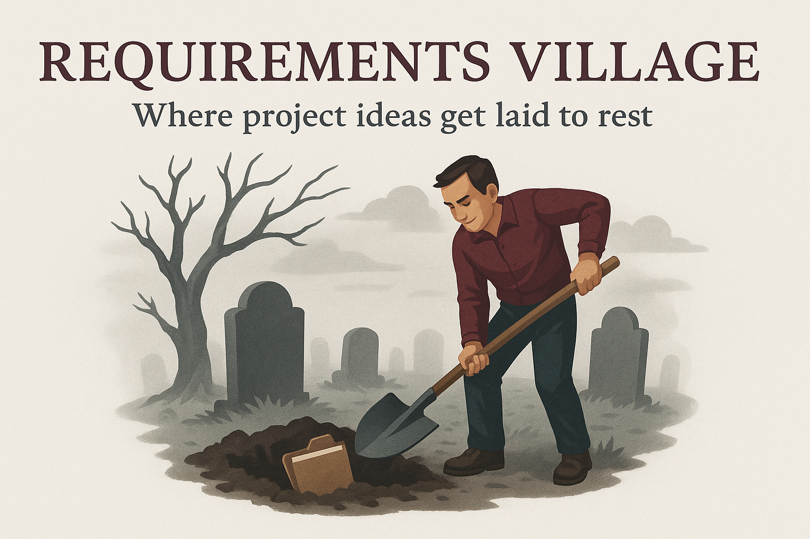

# Requirements Village

*Where project ideas get laid to rest.*

Requirements Village is a Blazor Server application for organizing software project ideas — especially the ones you may never finish. It provides a structured home for your someday/maybe/wishlist projects and lets you define tech stacks, components, and deployment plans for each one.

---

## 🧰 Tech Stack

- **Frontend:** Blazor Server (.NET 8)
- **Backend:** ASP.NET Core
- **Authentication:** ASP.NET Core Identity
- **Data Layer:** Entity Framework Core (Code-First)
- **Database:** SQLite
- **Testing:** xUnit + FluentAssertions
- **Language:** C# (record-heavy, immutable, functional-first style)
- **Containerization:** Optional Docker support
