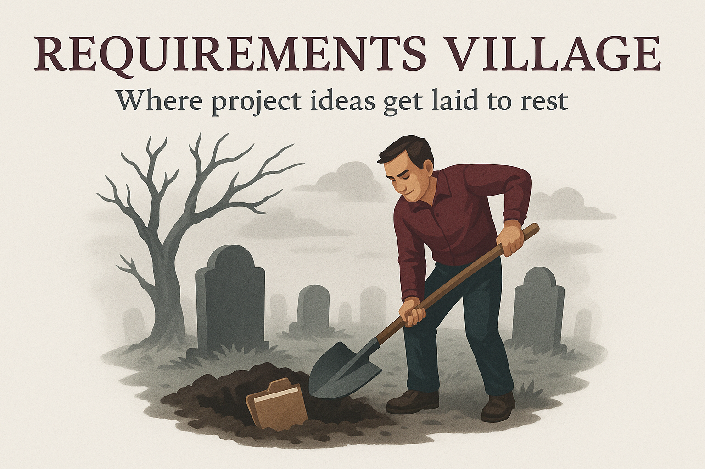

# Requirements Village

*Where project ideas get laid to rest.*

Requirements Village is a full-stack F# application for organizing software project ideas — especially the ones you may never finish. It provides a structured home for your someday/maybe/wishlist projects and lets you define tech stacks, components, and deployment plans for each one.

---

## 🧰 Tech Stack

### Backend
- **Language:** F# (functional programming)
- **Web Framework:** Giraffe on ASP.NET Core
- **Data Access:** Dapper with SQLite
- **Database:** SQLite
- **Authentication:** ASP.NET Core Identity (planned)

### Frontend
- **Language:** F# (compiled to JavaScript via Fable)
- **Architecture:** Elmish (Model-View-Update pattern)
- **UI Library:** Feliz (type-safe React bindings)
- **Styling:** Tailwind CSS + DaisyUI
- **Build:** Webpack with hot module replacement

---

## 📂 Project Structure

```
RequirementsVillage/
├── RequirementsVillage.FSharp.Api/     # Backend API
│   ├── Program.fs                      # Giraffe app configuration
│   ├── Endpoints.fs                    # HTTP route handlers
│   ├── Models.fs                       # Domain types
│   ├── Services.fs                     # Business logic
│   ├── Database.fs                     # Data access (planned)
│   └── wwwroot/                        # Static files (from client build)
├── RequirementsVillage.FSharp.Client/  # Frontend SPA
│   ├── src/
│   │   ├── App.fs                      # Elmish program entry
│   │   ├── State.fs                    # Update logic
│   │   ├── Types.fs                    # Model and messages
│   │   ├── Api/                        # API client modules
│   │   ├── Components/                 # Reusable UI components
│   │   └── Pages/                      # Page views
│   ├── webpack.config.js               # Build configuration
│   └── package.json                    # Node dependencies
├── CLAUDE.md                           # Project context for AI assistants
└── RequirementsVillage.sln             # .NET solution file
```

---

## 🚀 Getting Started

### Prerequisites

- .NET SDK 8.0 or later
- Node.js 18+ and npm
- F# language support in your IDE (Rider, VS Code with Ionide, or Visual Studio)

### Development Mode

For the best development experience, run both the API and client with hot reload:

```bash
# Terminal 1 - Start the API:
cd RequirementsVillage/RequirementsVillage.FSharp.Api
dotnet run

# Terminal 2 - Start the client dev server:
cd RequirementsVillage/RequirementsVillage.FSharp.Client
npm install
npm start
```

- **API:** `http://localhost:5000`
- **Client (with hot reload):** `http://localhost:8080`

### Production Build

```bash
# Build the client
cd RequirementsVillage/RequirementsVillage.FSharp.Client
npm install
npm run build

# Run the API (serves built client files)
cd RequirementsVillage/RequirementsVillage.FSharp.Api
dotnet run --configuration Release
```

Visit `http://localhost:5000`

---

## 🌐 API Endpoints

- `GET /api/health` - Health check with timestamp
- `GET /api/projects` - Get all projects (example data for now)

## 📱 Client Routes

- `/` - Landing page with gothic theme
- `/dashboard` - Project management dashboard

---

## 🏗️ Architecture

### Functional Programming Throughout

This project demonstrates functional programming principles in both frontend and backend:

- **Immutable Data:** All data structures are immutable
- **Pure Functions:** Business logic is side-effect free
- **Pattern Matching:** Exhaustive handling of all cases
- **Type Safety:** F#'s type system prevents runtime errors
- **No Nulls:** Option types instead of null references

### Frontend Architecture (Elmish)

```fsharp
// Model-View-Update pattern
type Model = { Projects: Project list; Theme: Theme }
type Msg = LoadProjects | ProjectsLoaded of Result<Project list, ApiError>
let update msg model = // Returns new model and commands
let view model dispatch = // Returns React elements
```

### Backend Architecture (Giraffe)

```fsharp
// Functional HTTP handlers
let projectsHandler : HttpHandler =
    fun next ctx ->
        task {
            let! projects = ProjectService.getAllProjects()
            return! json projects next ctx
        }
```

---

## 🎨 Visual Design

The application features a Gothic aesthetic with polished irreverence, as demonstrated in the mockups found in `./assets/claude/`. The design balances professional SaaS functionality with a playful "project graveyard" theme.

---

## 🛠️ Development Guidelines

### Code Style
- **Indentation:** 2 spaces for all F# and JavaScript files
- **Line Length:** 80 characters maximum
- **F# Conventions:** 
  - Prefer immutable data structures
  - Use pattern matching over if/else
  - Leverage type inference
  - Organize code with modules

### Key Libraries
- **Fable:** F# to JavaScript compiler
- **Elmish:** Elm-like Model-View-Update architecture
- **Feliz:** Type-safe React DSL for F#
- **Giraffe:** Functional web framework for ASP.NET Core
- **Dapper:** Lightweight object mapper for data access
- **Tailwind CSS:** Utility-first CSS framework
- **DaisyUI:** Component library for Tailwind CSS

---

## 🚧 Roadmap

- [x] SQLite database integration with Dapper
- [ ] Switch from in-memory to SQLite persistence
- [ ] User authentication with ASP.NET Core Identity
- [ ] Real project persistence
- [ ] Project categorization and tagging
- [ ] Search and filtering capabilities
- [ ] Export functionality
- [ ] Fable.Remoting for type-safe client-server communication